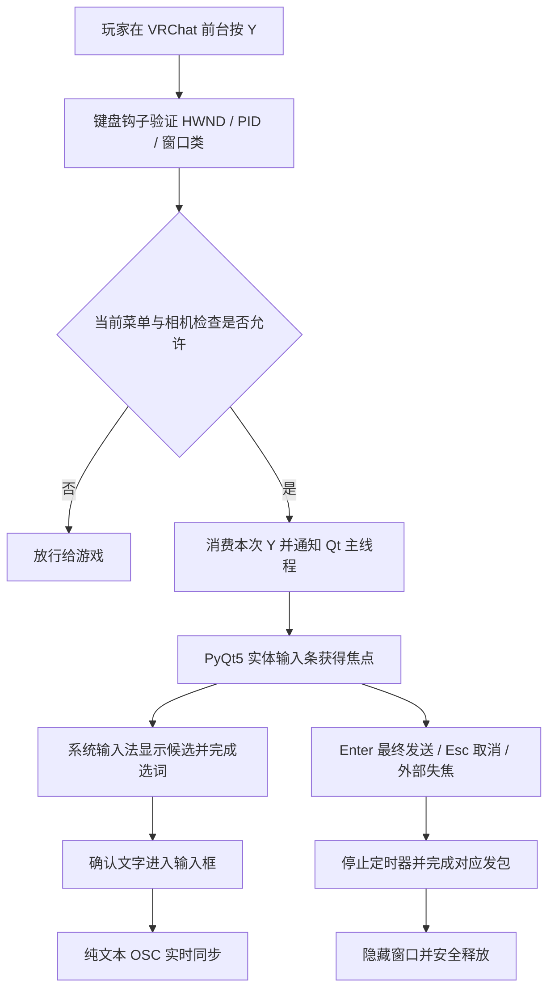

# VRC LinguaBar：设计初衷与技术说明

## 1. 设计初衷

VRChat 中的交流常常跨越语言。玩家可能上一句话输入英文，下一句话需要中文选词，再下一句需要日文假名转汉字。对这些玩家来说，候选框不是装饰，而是输入过程的一部分。

如果游戏原生输入框没有顺畅承接系统输入法，玩家就可能看不到候选、无法舒服地组词，或不得不切到记事本再复制回游戏。VRC LinguaBar 的初衷是减少这种打断：**让玩家保留按 Y 聊天的习惯，在标准桌面文本控件中使用熟悉的输入法与候选框，再把确定的文字交给游戏显示。**

“语伴输入条”强调的是输入与交流的陪伴。它不是翻译器，也不尝试替代 Windows 输入法。项目希望照顾中文、日文等需要组词选词的语言，同时保留英文直输和混合输入的便利。

## 2. 设计目标与边界

| 目标 | 对应选择 |
|---|---|
| 不额外记一套聊天开关 | 使用 Y 唤醒，取消手动启用组合键 |
| 候选框尽量走系统标准路径 | 使用真实的 PyQt5 `QLineEdit`，让 IME 管理候选与转换 |
| 少切换、少复制 | 已提交到输入条的文字直接经 OSC 同步到游戏 |
| 输入条不占住屏幕 | 失去外部焦点时取消本次输入并关闭 |
| 本地输入保持静止 | 不生成或追加动态点，不在状态标签播放动画 |
| 避免误作用于其他游戏 | 同时验证窗口类、可执行文件名与 PID |
| 便于分发与排查 | 应用保持单文件；文档、依赖清单和测试独立存放 |

没有把“0 延迟”“永不残留”“所有输入法百分百兼容”作为可保证的指标。Windows 调度、游戏 UI、输入法实现和 UDP 都存在外部边界。

## 3. 技术组成与各自的作用

| 技术 / 组件 | 项目中负责什么 | 为什么采用 |
|---|---|---|
| Python | 组织状态、参数、线程与事件 | 易于阅读和分发，适合小型桌面工具 |
| PyQt5 / Qt Widgets | 实体输入条、编辑框、布局、透明背景和托盘 | 让文本输入进入标准桌面控件流程，而不是在游戏画面上自行绘制一个假输入框 |
| `QInputMethodEvent` | 获取预编辑字符串与候选确认后的提交文本 | 区分“正在选词”与“已经确认”，减少确认键误发整句 |
| IMM32 | 查询组词状态、取消输入法组合串、释放输入上下文 | 为 Qt 事件提供 Windows 原生补充，不依赖单一途径判断组词 |
| `ctypes` | 声明并调用 Win32/IMM API、建立回调 | 直接访问键盘钩子和焦点 API；按指针宽度声明句柄与返回值 |
| `WH_KEYBOARD_LL` | 在输入到达目标窗口前观察并按条件接管 Y | 避免外部输入条与游戏原生聊天框同时弹出 |
| pywin32 | 枚举窗口、查询目标所在显示器 | 简化常用 Windows 窗口操作 |
| `threading.Thread` + Win32 消息循环 | 承载低级键盘钩子 | 把全局按键回调与 Qt 主线程分开，缩短回调中的工作 |
| Qt queued signal | 把唤醒请求从钩子线程传给 GUI | 所有窗口创建、编辑和销毁都在 Qt 主线程完成 |
| `AttachThreadInput` | 必要时短暂连接输入队列以帮助激活输入条 | 争取获得真实键盘焦点，成功或失败后都尝试立即解绑 |
| `SetWinEventHook` + Qt 失焦事件 | 收到前台窗口切换和输入条停用通知 | 事件驱动关闭，不使用持续的 100ms 失焦轮询 |
| python-osc | 构造聊天 OSC 消息，解析收到的相机消息 | 遵循 VRChat 已有 OSC 接口，不使用复制粘贴模拟发送 |
| 标准库 `socket` | 持有一个非阻塞 UDP 发送 socket | 同步尝试发送，避免积压稍后覆盖最终消息的预览队列 |
| `QUdpSocket` | 在 Qt 事件循环中接收相机状态 | 无需额外网络线程，读到数据再处理 |
| `QTimer` | 关闭空闲打字灯、一次性焦点核验、后台状态维护 | 把工作接入 Qt 事件循环；每个计时器有清楚的职责 |

`PyQt5-Qt5` 是 Qt 二进制运行库，`PyQt5-sip` 是 Python 与 Qt 的绑定支撑，它们不是第二套 UI 工具。`argparse`、`logging`、`time`、`signal` 等均来自 Python 标准库，不用单独安装。

## 4. 整体数据流

## 5. 为什么实体输入框有助于候选框显示

输入法通常包含三个阶段：开始组词、维护预编辑字符串、提交选中的文字。Qt 用 `QInputMethodEvent` 表达预编辑与提交，这让标准编辑控件能够参与系统输入法的正常协作。[Qt 输入法事件文档](https://doc.qt.io/archives/qt-5.15/qinputmethodevent.html)

本项目不是在游戏画面上画文字，也不自己实现候选列表。它创建一个拥有原生窗口句柄、实际键盘焦点的编辑器。系统输入法在这个编辑器上处理组词与候选，程序只取得提交结果。

`ImeLineEdit` 在 Qt 原有编辑行为上增加少量保护：记录 `preeditString()`，结合 `ImmGetCompositionStringW()` 查询组词状态；组词时把 Enter 留给输入法；刚提交候选后用 80ms 防误发送窗口，避免同一次确认动作顺带发出整句。候选词本身和输入法 UI 仍由系统管理。

这条路径有利于兼容，但不代表所有 TSF/IMM、第三方输入法及候选窗都已通过测试。

## 6. Y 键接管与线程划分

控制器每 500ms 枚举一次目标窗口，把符合 `UnityWndClass`、`VRChat.exe` 及可选指定 PID 的结果发布为新缓存。该扫描用于识别游戏窗口，不负责失焦关闭。

钩子线程只做短路径判断：

1. 仅处理需要关注的 Y；注入按键和带修饰键的组合按当前规则放行。
2. 校验当前前台 HWND、PID、窗口类，以及自动防护状态。
3. 允许接管时，消费唤醒这一次 Y 的按下、长按重复和抬起。
4. 通过 Qt 信号发送唤醒请求，立即结束回调。

进程名查询、窗口创建、网络收包和日志输出不放在低级键盘回调中。Windows 会对过慢的钩子实施超时处理，因此这里减少工作量比在回调中执行复杂识别更重要。[Microsoft 低级键盘钩子文档](https://learn.microsoft.com/en-us/windows/win32/winmsg/lowlevelkeyboardproc)

GUI 收到请求后再次验证前台、进程及状态版本，避免玩家按 Y 后已经切走、却迟到弹出窗口。`pyqtSignal(object)` 用于完整传递 HWND，Win32 `LRESULT` 使用 `c_ssize_t`，避免按 32 位整数误处理 64 位数据。

## 7. 焦点获取与失焦关闭

显示输入条后，先尝试普通的窗口激活。必要时短暂使用 `AttachThreadInput`，并在 `finally` 中解绑。程序不修改系统全局前台锁定超时，不长期绑定输入队列。[Microsoft AttachThreadInput 文档](https://learn.microsoft.com/en-us/windows/win32/api/winuser/nf-winuser-attachthreadinput)

成功输入必须有真实焦点。如果激活失败，本次输入条直接取消并关闭。

失焦由两条事件路径触发：Windows 的 `EVENT_SYSTEM_FOREGROUND` 和 Qt 的 `WindowDeactivate`。收到事件后启动一个 **0ms 单次**核验，在当前激活事件处理结束后检查最新前台；它不是每隔 0ms 无限执行的轮询。[Microsoft SetWinEventHook 文档](https://learn.microsoft.com/en-us/windows/win32/api/winuser/nf-winuser-setwineventhook)

输入条所属弹窗不被当成外部软件。组词时，某些已知微软候选窗也允许完成输入；但不能仅因为还在组词就无条件忽略失焦。切到浏览器等无关窗口仍关闭输入条。第三方独立候选窗不一定包含在这些判断中。

## 8. OSC 发送与文字长度

| 触发 | 地址 | 参数 |
|---|---|---|
| 已确认文字变化 | `/chatbox/input` | `[text, True, False]` |
| Enter 最终发送非空文字 | `/chatbox/input` | `[text, True, True]` |
| Esc / 外部失焦 / 取消 | `/chatbox/input` | `["", True, False]` |
| 输入或组词活动 | `/chatbox/typing` | `[True]` |
| 空闲、取消或发送结束 | `/chatbox/typing` | `[False]` |

第二个参数是“立即发送”布尔值，第三个参数是“播放通知音”布尔值，不控制隐私或可见范围。空输入最终发送不触发通知音。接口说明见 [VRChat Chatbox OSC 文档](https://docs.vrchat.com/docs/osc-as-input-controller)。

发送 socket 在 GUI 主线程内使用，设置为非阻塞；不建立延迟预览队列。关闭流程先停止相关工作再发送最终包或清空包，因此不会由本工具稍后又发出旧动画覆盖最终文字。UDP 依然不提供游戏端收包确认。

长度按 144 个 UTF-16 单元保守控制，和 Qt 5 的字符串边界对齐。程序去掉 NUL，把换行替换为空格，并在截断时避免留下孤立代理项。该规则不等同于 144 个视觉字形；组合字符、emoji 的计数可能与直觉不同。

## 9. 菜单与相机自动防护

`MenuGuard` 不记忆“按过一次 Esc 就永久禁用”的状态，每次 Y 都重新评估当前原生 UI。可见系统光标、原生菜单和原生输入控件是阻止误唤醒的信号；恢复正常后下次 Y 自动放行到本工具。

`CameraMonitor` 默认在本机 9001 接收 `/usercamera/Mode`。模式非 0 时阻止唤醒，模式 0 时自动恢复。端口独占绑定，避免多个监听器共享端口导致不可预测的包分配；冲突时提示相机状态未知。每轮最多处理 128 个数据包，再让出事件循环，避免收包压住 UI。[VRChat 相机 OSC 说明](https://docs.vrchat.com/docs/vrchat-202533)

局限包括：Unity 自绘菜单未必有系统菜单句柄；菜单未必显示系统光标；相机状态可能未上报或丢失；本地 UDP 接收也不能认证发送程序的 PID。因此它是自动预防机制，而不是可靠读取所有游戏内部状态。

## 10. 资源与对象生命周期

`InputBar.finish()` 是统一关闭入口。它先设置 `closing`，停止定时器、阻断编辑信号，然后按发送或取消路径发包，取消 IME 组合串、隐藏窗口并调用 `deleteLater()`。重复进入关闭路径不会重复执行清空，避免覆盖 Enter 已发送的最终消息。

`deleteLater()` 在 Qt 合适的事件循环时点回收对象，不是即时强制释放。控制器等实际 `destroyed` 信号后再清除引用；退出时处理待删除事件。键盘钩子、前台事件钩子、UDP socket 和菜单也都有对应的停止或释放路径。[Qt QObject 销毁说明](https://doc.qt.io/qt-6/qobject.html#deleteLater)

当前计时器职责：

| 计时器 | 周期 | 用途 |
|---|---|---|
| 输入条 `idle_timer` | 默认 2500ms，单次 | 关闭空闲打字灯 |
| 输入条 `focus_check` | 0ms，事件触发后单次 | 核验当前前台，决定是否取消输入 |
| 控制器 `scan_timer` | 500ms | 刷新经过进程验证的游戏窗口缓存 |
| 控制器 `heartbeat` | 250ms | 报告服务状态、发送错误，并给 Python 处理 Ctrl+C 的机会 |

动态点计时器和 100ms 失焦看门狗均已删除。窗口相关定时器由 Qt 父子对象关系管理。

## 11. 单文件中各个类负责什么

| 类 / 函数 | 职责 |
|---|---|
| `Controller` | 应用生命周期、窗口发现、接收唤醒请求、创建输入条、退出清理 |
| `YHook` | 原生键盘钩子线程、Y 完整按键处理、pending 去重 |
| `Bridge` | 用线程安全的 Qt queued signal 搬运唤醒请求 |
| `MenuGuard` | 自动 UI 防护、相机与会话状态版本 |
| `ForegroundMonitor` | Windows 前台事件订阅与卸载 |
| `CameraMonitor` | 只读接收并解析相机 OSC 状态 |
| `InputBar` | UI、文字同步、焦点核验和统一关闭流程 |
| `ImeLineEdit` | 标准编辑行为之上的 IME 组词与确认键保护 |
| `OscSender` | OSC 编码、非阻塞 UDP 发送及错误计数 |
| `acquire_focus()` | 有边界的焦点获取和临时输入队列附着 |
| `clip_text()` | 单行规范化、UTF-16 长度保护 |

类的拆分用于让职责清楚，程序运行入口仍只有 `vrchat_linguabar.py`，不需要额外的项目 Python 模块。
